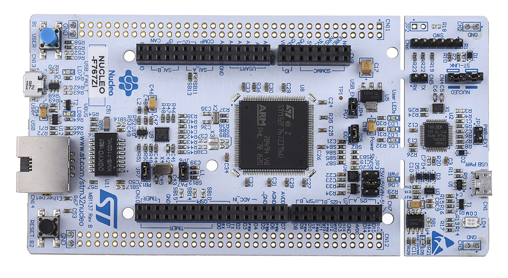

# STM32 F767ZI Tutorials

**⚠️ Important:**

> These tutorials were created using the NUCLEO-F767ZI evaluation board, with the ST-LINK providing the clock signal to the Ethernet PHY.

**Without DHCP:**

* [LWIP Basic](./LWIP_BASIC/README.md)
* [LWIP FreeRTOS Basic](./LWIP_FREERTOS/README.md)
* [LWIP FreeRTOS HTTP Server Basic](./LWIP_FREERTOS_HTTP/README.md)

**✅ Important:**

> These tutorials were created using the NUCLEO-F767ZI evaluation board, configured with a standalone RMII clock for Ethernet functionality.

**With DHCP**

* [LWIP FreeRTOS 1602](./LWIP_FREERTOS_1602/README.md)